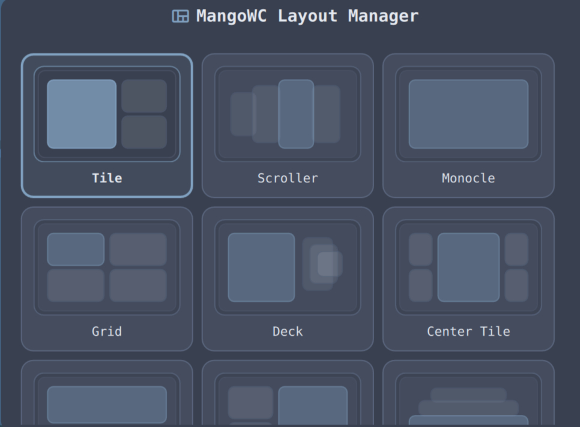

# MangoWC Layout Manager

A simple DMS widget for switching the active MangoWC layout from the bar.

## Dependency

This plugin requires MangoWC's IPC helper:

- `mmsg`

The widget uses:

- `mmsg -g -l` to read the current layout
- `mmsg -d setlayout,<layout>` to switch layouts

## Supported Layouts

The chooser ships with the layouts documented by MangoWC at:

- https://mangowc.vercel.app/docs/window-management/layouts/

Included layouts:

- `tile`
- `scroller`
- `monocle`
- `grid`
- `deck`
- `center_tile`
- `vertical_tile`
- `right_tile`
- `vertical_scroller`
- `vertical_grid`
- `vertical_deck`
- `tgmix`

## Install

Copy this directory into:

- `~/.config/DankMaterialShell/plugins/DMSMangoWCLayoutManager`

Then restart DMS and enable the plugin in the Plugins settings tab.

## Notes

- Layout changes are applied through MangoWC's currently focused context.
- If `mmsg` is missing or MangoWC is not running, the widget shows an unavailable state.
